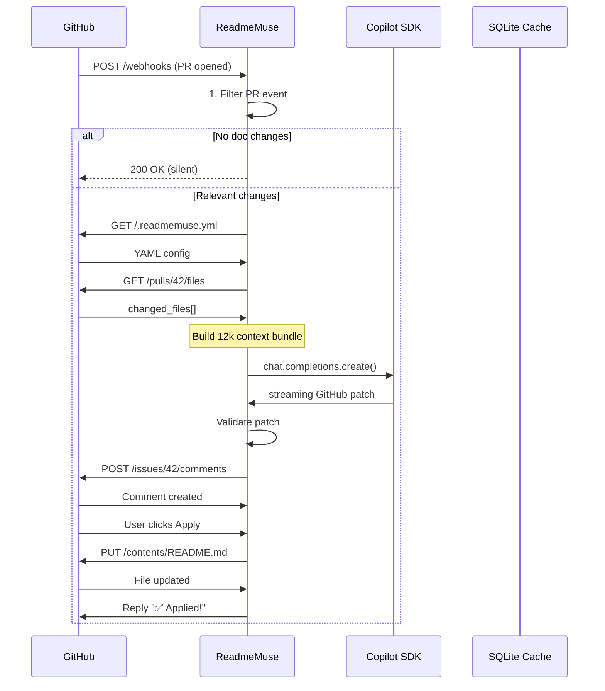

# ReadmeMuse Architecture

This document provides a comprehensive overview of ReadmeMuse's architecture, data flow, and system design.

## Table of Contents

- [Overview](#overview)
- [End-to-End Data Flow](#end-to-end-data-flow)
- [Detailed Process Legend (DFD Level 1)](#detailed-process-legend-dfd-level-1)
- [Sequence Diagram](#sequence-diagram)
- [Directory Structure](#directory-structure)
- [Key Components](#key-components)

## Overview

ReadmeMuse is a GitHub App that automatically suggests documentation updates when pull requests modify watched code files. The system uses AI-powered analysis to generate precise documentation patches that maintain the repository's voice and style.

### Core Workflow

1. **Webhook Reception**: GitHub sends PR events to ReadmeMuse
2. **Event Filtering**: System checks if changes affect watched paths
3. **Context Assembly**: Gathers PR diff, existing docs, and repo structure
4. **AI Analysis**: OpenAI SDK generates documentation patches (see ARCHITECTURE_DECISIONS.md for why not Copilot SDK)
5. **Validation**: Ensures patches are valid and safe
6. **PR Comment**: Posts suggestions as formatted GitHub comments
7. **User Interaction**: Repository maintainers can apply, snooze, or ignore suggestions

## End-to-End Data Flow

```
[GitHub] ──PR opened──► [ReadmeMuse Server] ──webhook──► HTTP 200
  │                           │                           │
  │                           │1. Filter (100ms)          │
  │                           │   ↓                       │
  │                           └──► REJECT ──"No changes"──► [PR Timeline]
  │                                        │
  │                                        ▼
  │                           2. Fetch .readmemuse.yml (200ms)
  │                                        │
  │                                        ▼
  │                           3. Changed Files API (300ms)
  │                           │ src/api/*.js → README.md? 
  │                           │   ↓
  │                           └──► NO → "No doc impact"
  │                                        │
  │                                        ▼
  │                 ┌──────────────────────4. CONTEXT BUNDLE──────────────────────┐
  │                 │ PR Diff (5k) │ Repo Tree │ Existing Docs │ Voice Examples │
  │                 └───────────────┬─────────────────────────────────────────────┘
  │                                 │
  │                                 ▼
  │                    5. AI Analysis (OpenAI SDK) (2-5s) ◄── workspace context
  │                                 │
  │                                 ▼
  │                    6. Patch Validation (100ms)
  │                           │ ✅ Valid GitHub diff?
  │                           │   ↓
  │                           └──► INVALID → "Manual review"
  │                                        │
  │                                        ▼
  │                    7. POST /issues/42/comments (300ms)
  │                                 │
  │                                 ▼
  ▼                    [GitHub PR Timeline] ◄── "🤖 ReadmeMuse: 1 patch"
                        │
                        ▼
             ┌──────────┼──────────┐
             │          │          │
        [✅ Apply]  [⚠️ Snooze] [🚫 Ignore]
             │          │          │
             ▼          ▼          ▼
      8. Apply Patch   Skip      Repo blacklist
      Handler (500ms)              (SQLite)
```

### Flow Timing Analysis

- **Fast Path** (reject): ~100ms (filter only)
- **No Impact Path**: ~600ms (filter + config + files check)
- **Full Analysis**: ~3-6 seconds (includes AI generation)
- **Patch Application**: Additional 500ms when user applies

## Detailed Process Legend (DFD Level 1)

This section breaks down each major process in the system:

### 1.0 WEBHOOK FILTER

```
┌─────────────────────────────────────────────────────────────────────┐
│ 1.0 WEBHOOK FILTER                                                  │
│ External Entity: GitHub                    Process: 1.1 Validate    │
│   ↓ "pull_request" payload                 Event/Action             │
│ Data Flow: PR Payload ──► 1.1 ──► REJECT / PROCEED                 │
└─────────────────────────────────────────────────────────────────────┘
```

**Responsibilities:**
- Validates webhook signature
- Filters PR events (opened, synchronize)
- Checks installation permissions
- Returns HTTP 200 immediately

### 2.0 CONFIG LOOKUP

```
┌─────────────────────────────────────────────────────────────────────┐
│ 2.0 CONFIG LOOKUP                                                   │
│ Data Store: GitHub Contents (.readmemuse.yml) Process: 2.1 Parse    │
│   ↑ YAML decoded ──► 2.1 ──► watch_paths array                     │
└─────────────────────────────────────────────────────────────────────┘
```

**Responsibilities:**
- Fetches `.readmemuse.yml` from repository root
- Parses YAML configuration
- Extracts `watchPaths` and `documentationFiles`
- Handles missing or invalid config gracefully

### 3.0 CHANGE DETECTION

```
┌─────────────────────────────────────────────────────────────────────┐
│ 3.0 CHANGE DETECTION                                                │
│ External Entity: GitHub Files API           Process: 3.1 DiffMatch  │
│   ↓ changed_files ──► 3.1 ──► code_changes → docs?                 │
└─────────────────────────────────────────────────────────────────────┘
```

**Responsibilities:**
- Fetches PR changed files list
- Matches files against configured `watchPaths`
- Determines if documentation impact is likely
- Short-circuits if no relevant changes

### 4.0 CONTEXT ASSEMBLY

```
┌─────────────────────────────────────────────────────────────────────┐
│ 4.0 CONTEXT ASSEMBLY                                                │
│ Process: 4.1 PR Diff    4.2 Repo Tree    4.3 Doc Extract          │
│   ↓ ───────────────┬───► 4.4 Bundle ──► 12k token payload         │
│ Data Store: GitHub APIs (parallel calls)                           │
└─────────────────────────────────────────────────────────────────────┘
```

**Responsibilities:**
- Gathers PR diff (limited to relevant files)
- Extracts current documentation content
- Includes repository structure context
- Bundles into AI-ready format (~12k tokens)

**Optimization:**
- Parallel API calls where possible
- Diff truncation for large changes
- Smart context selection

### 5.0 COPILOT AGENT

```
┌─────────────────────────────────────────────────────────────────────┐
│ 5.0 COPILOT AGENT                                                   │
│ External Entity: Copilot SDK               Process: 5.1 Prompt     │
│   ↓ context_bundle ──► 5.1 ──► streaming_patch                    │
│ Data Flow: workspace:my-saas context                               │
└─────────────────────────────────────────────────────────────────────┘
```

**Responsibilities:**
- Constructs analysis prompt with context
- Calls Copilot SDK API
- Streams response for efficiency
- Extracts documentation patches

**AI Model:**
- Uses GitHub Copilot SDK
- Workspace-aware context
- Preserves repository voice/style

### 6.0 PATCH VALIDATOR

```
┌─────────────────────────────────────────────────────────────────────┐
│ 6.0 PATCH VALIDATOR                                                 │
│ Process: 6.1 MarkdownSafe  6.2 SizeCheck  6.3 SectionMatch        │
│   ↓ raw_patch ──► 6.x ──► VALIDATED_PATCH / MANUAL_REVIEW         │
└─────────────────────────────────────────────────────────────────────┘
```

**Responsibilities:**
- Validates patch format (unified diff)
- Checks for unsafe content
- Verifies size limits
- Ensures section references exist

**Safety Checks:**
- No executable code injection
- Markdown syntax validation
- Reasonable patch size
- Valid file references

### 7.0 PR COMMENT

```
┌─────────────────────────────────────────────────────────────────────┐
│ 7.0 PR COMMENT                                                      │
│ External Entity: GitHub Issues API          Process: 7.1 Render    │
│   ↓ validated_patch ──► 7.1 ──► HTML comment w/ Apply button      │
└─────────────────────────────────────────────────────────────────────┘
```

**Responsibilities:**
- Formats patch as collapsible markdown
- Adds reasoning and summary
- Includes action buttons
- Posts to PR timeline

**Comment Features:**
- Expandable diff view
- AI reasoning explanation
- One-click apply action

### 8.0 APPLY PATCH

```
┌─────────────────────────────────────────────────────────────────────┐
│ 8.0 APPLY PATCH                                                     │
│ Data Store: GitHub Contents API             Process: 8.1 PatchApply│
│   ↑ user_click ──► 8.1 ──► PUT README.md (new SHA)                │
│ Data Flow: "✅ Applied!" reply                                     │
└─────────────────────────────────────────────────────────────────────┘
```

**Responsibilities:**
- Handles user interaction (Apply button)
- Fetches current file SHA
- Applies patch content
- Commits to PR branch
- Posts confirmation reply

**Error Handling:**
- Conflict detection
- Stale content warnings
- Rollback capability

## Sequence Diagram

The following Mermaid diagram illustrates the complete interaction flow between system components:



### Interaction Patterns

1. **Asynchronous Processing**: Webhook returns 200 immediately, processing happens in background
2. **Conditional Flow**: Multiple exit points for efficiency
3. **Parallel Operations**: Config and files fetched concurrently where possible
4. **User-Driven Actions**: Apply/Snooze/Ignore handled via separate webhook events
5. **State Management**: SQLite cache for blacklists and rate limiting

## Directory Structure

```
src/
├── index.ts                     # Main Probot app entry point
├── handlers/
│   └── pullRequestHandler.ts   # PR event handler (Process 1.0-3.0)
├── services/
│   ├── configService.ts         # Config loading (Process 2.0)
│   ├── analysisService.ts       # PR analysis orchestration (Process 4.0-5.0)
│   └── commentService.ts        # PR comment formatting (Process 7.0)
├── utils/
│   ├── pathMatcher.ts          # File pattern matching (Process 3.0)
│   └── aiAnalyzer.ts           # AI-powered doc analysis (Process 5.0)
└── types/
    ├── config.ts               # Configuration types
    └── suggestion.ts           # Suggestion types
```

## Key Components

### Probot Framework

ReadmeMuse is built on [Probot](https://probot.github.io/), GitHub's framework for building GitHub Apps. Probot handles:
- Webhook reception and signature validation
- GitHub API authentication
- Event routing
- Installation management

### Configuration System

The `.readmemuse.yml` configuration uses:
- **YAML parsing** via js-yaml
- **Path matching** via minimatch (supports glob patterns)
- **Default fallbacks** for missing config

Example:
```yaml
watchPaths:
  - "src/**/*"
  - "lib/**/*.ts"
documentationFiles:
  - "README.md"
  - "docs/**/*.md"
```

### AI Integration

The Copilot SDK integration:
- Uses GitHub's official Copilot API
- Provides workspace-aware context
- Generates style-consistent patches
- Streams responses for efficiency

### Safety & Validation

Multiple validation layers ensure:
- **No code execution** in generated patches
- **Size limits** prevent abuse
- **Format validation** ensures valid diffs
- **Content sanitization** prevents XSS

## Performance Considerations

### Optimization Strategies

1. **Early Exit**: Reject irrelevant PRs within 100ms
2. **Parallel Fetching**: Config and files APIs called concurrently
3. **Context Limiting**: Truncate large diffs to stay under token limits
4. **Caching**: SQLite cache for blacklists and rate limits
5. **Streaming**: AI responses streamed to reduce latency

### Scalability

- **Stateless design**: Each webhook handled independently
- **Rate limiting**: Per-repository limits prevent abuse
- **Async processing**: Non-blocking event handlers
- **Horizontal scaling**: Multiple instances supported

## Security

### Authentication

- **GitHub App** model with granular permissions
- **Private key** authentication for API calls
- **Webhook signatures** validated on every request

### Authorization

- **Repository-level** permissions
- **Installation context** determines access
- **User actions** require appropriate permissions

### Data Privacy

- **No persistent storage** of repository content
- **Temporary context** discarded after analysis
- **Blacklist only** stored in SQLite
- **No third-party sharing** of code/diffs

## Error Handling

### Graceful Degradation

- **Config missing**: Use safe defaults
- **API failures**: Retry with exponential backoff
- **AI errors**: Fall back to manual review suggestion
- **Validation fails**: Skip patch, log error

### User Communication

- **Silent failures** for non-critical paths
- **PR comments** for actionable errors
- **GitHub checks** for status visibility
- **Logs** for debugging and monitoring

## Future Enhancements

Potential improvements to the architecture:

1. **Multi-file patches**: Support updating multiple docs in one suggestion
2. **Incremental updates**: Track applied patches to avoid duplicates
3. **Custom prompts**: Per-repo AI instructions in config
4. **Webhooks for Apply**: Server-side patch application without user clicks
5. **Analytics dashboard**: Track suggestion acceptance rates
6. **Multi-language support**: Documentation in non-English languages

## References

- [Probot Documentation](https://probot.github.io/)
- [GitHub Apps Guide](https://docs.github.com/en/apps)
- [GitHub REST API](https://docs.github.com/en/rest)
- [Minimatch Documentation](https://github.com/isaacs/minimatch)
